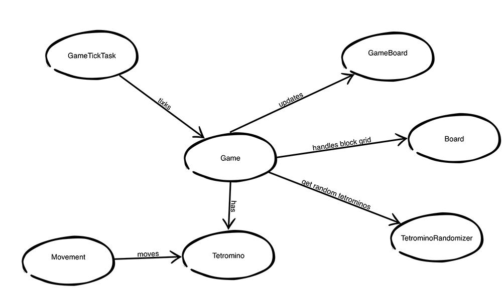
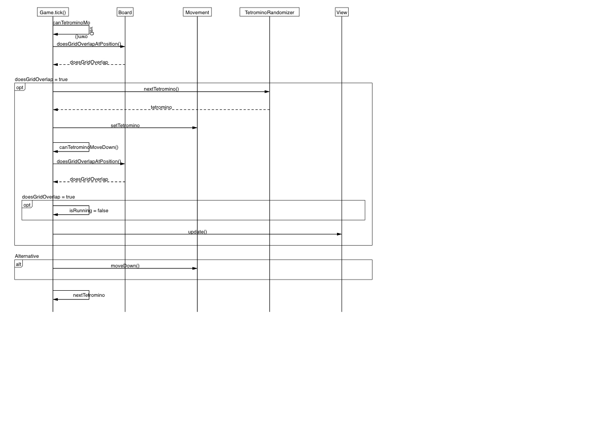

# Aihe: Tetris #

Tavoitteena on tehdä tribuuttia eräälle maailman tunnetuimmista tietokonepeleistä ja luoda oma Tetris-klooni Javaa hyödyntäen.

Pyrkimyksenä kloonin teossa on yrittää tuoda 80-luvun tunnelma peliin, luoda mahdollisimman aito ensimmäisiä versioita kunnioittava peli, joten pelin grafiikka on varsin pelkistettyä

## Pelin toiminta ##

Pelaajan tehtävänä on koota erimuotoisista putoavista paloista rivejä vaakasuoraan. Kun rivi on vaakasuorassa kokonainen, häviää rivi ja ylläolevat palikat tippuvat yhden alaspäin.
Pelin tavoitteena on hävittää näitä rivejä paloja käyttämällä. Paloja voi ohjata sivusuunnassa ja niitä voi kiertää 4 ilmansuunnan mukaisesti.

Pelin aikana yksi pala kerrallaan tippuu alas jota pelaaja voi ohjata.

Peliä ei voi voittaa, vaan tavoitteena on saada mahdollisimman paljon pisteitä rivejä hävittämällä.

Peli loppuu kun ruudulle ei enää mahdu tippumaan paloja.

## Käyttöohjeet ##

Pelin käyttö on erittäin yksinkertaista:

`W` -näppäimestä pyöritetään tetrominoa.
`S` -näppäimestä pudotetaan tetromino.
`A` -näppäin siirtää tetrominoa vasemmalle.
`D` -näppäin siirtää tetrominoa oikealle.

### Pelin rakenne ###

Ohessa järjestelmän luokkakaavio

Sekvenssikaaviot tärkeimmistä toiminnoista:

Pelin rakenne perustuu Game-luokkaan, joka ohjaa pelin toimintoja. Game-luokalla on oliomuuttujana luokka nimeltä Board. Tämä luokka sisältää varsinaisen kaksiulotteisen pelialueen, jota Game päivittää tarpeen mukaan.

Game-luokka pyytää satunnaisia tetrominoja TetrominoRandomizer-luokalta, piirtää ne boardille joka taasen annetaan UI-puolelle piirrettäväksi näytölle.

Movement-luokka kuuntelee käyttäjän antamia komentoja ja liikuttaa tetrominoa sen mukaisesti.  
